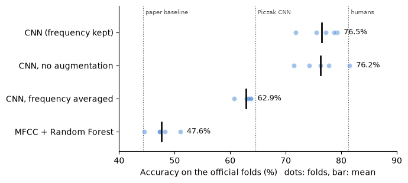
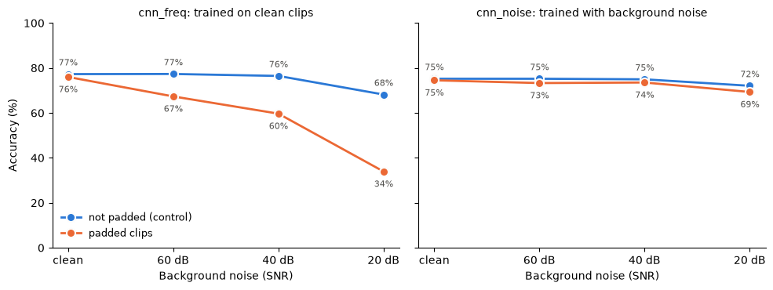
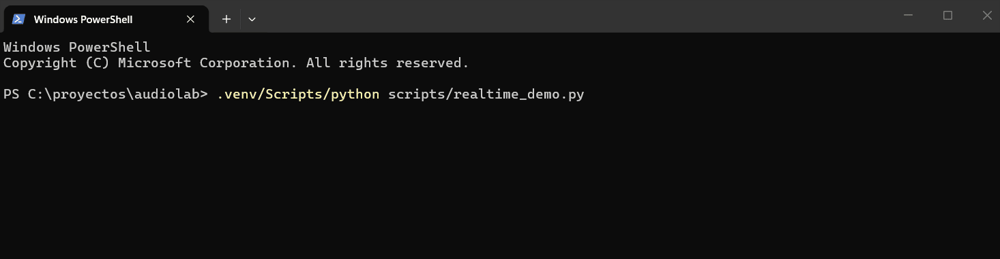
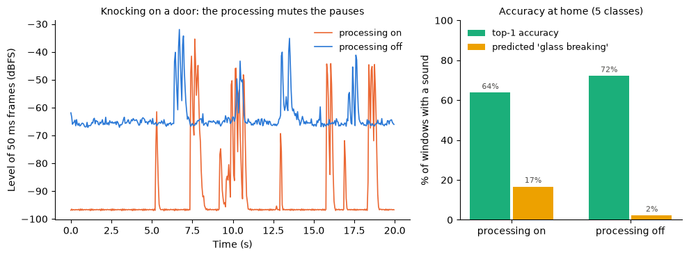
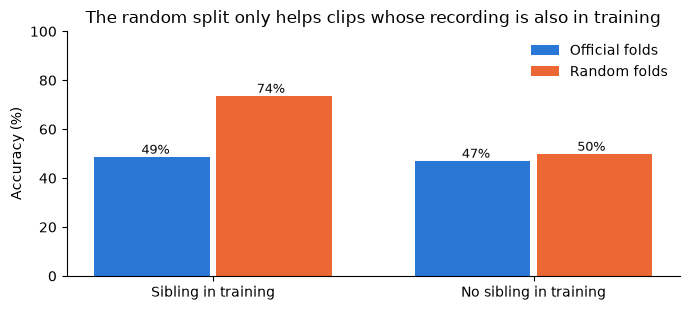

# audiolab

[](https://github.com/victor-merino-hub/audiolab/actions/workflows/tests.yml)

Audio signal processing and machine learning for **hearables**: from DSP fundamentals to
sound classification and noise reduction under real-time constraints.

> Work in progress. I am a Telecommunications Engineering student building this project
> step by step to learn audio DSP and ML in depth. See the [roadmap](#roadmap).

## Results so far

### Environmental sound classification (ESC-50)

[ESC-50](https://github.com/karolpiczak/ESC-50): 2,000 real clips of 5 s in 50 classes, evaluated
with the 5 official cross-validation folds. Chance level is 2%.

| Model | Weights | Accuracy | Reference |
|---|---|---|---|
| MFCC statistics + Random Forest | - | 47.6% ± 2.1% | 44.3% in the ESC-50 paper |
| **CNN on log-mel spectrograms** | 149k | **76.5% ± 2.7%** | 64.5% in Piczak (2015) |
| CNN trained with background noise | 149k | 75.0% ± 4.0% clean, **71.5%** with noise at 20 dB SNR | see [below](#the-digital-silence-shortcut-and-how-noise-training-removes-it) |
| Human listeners | | | 81.3% |



The CNN (4 conv blocks, trained on a laptop CPU in 47 minutes) wins most where the baseline
was blind: averaging MFCCs over time destroys temporal patterns, so **clock tick goes from 5% to 80%**
and car horn from 10% to 82%. Two design experiments, with everything else fixed:

- **Keep the frequency position** (average only over time at the end): +13.6 points. Time shifts
  should not change the class, but frequency position does: a steady tone is a car horn or an
  alarm depending on where it sits. Without it the network cannot even fit its training set.
- **Data augmentation** (time shift + SpecAugment): no measurable gain here (76.5% vs 76.2%). The
  time shift is redundant with a network that already averages over time. For scale: retraining
  the same model on a GPU instead of the CPU changes 9% of the predictions and the mean by 0.5
  points, so differences below ~1 point are noise.

**Sanity checks** before trusting a result this far above the reference: training on shuffled
labels gives 2.2% (chance: 2%), so nothing leaks from the test folds; and the class-dependent
band-limiting the dataset authors warn about is a weak cue (3.9% on its own). The gap with the 2015
CNN is mostly a smaller model (149k vs ~26M weights), whole clips instead of 1 s segments, and batch
normalization.

Notebooks: [exploration](notebooks/02_esc50_exploration.ipynb) · [baseline and leakage](notebooks/03_esc50_baseline.ipynb) · [CNN](notebooks/04_esc50_cnn.ipynb) · [robustness](notebooks/05_esc50_robustness.ipynb) · [real time](notebooks/06_realtime.ipynb)

### The digital silence shortcut, and how noise training removes it

ESC-50 pads short clips to 5 s with exact zeros, more for some classes (glass breaking, sneezing)
than others, and the network learns to use it. A real microphone never outputs exact zeros: adding
pink background noise only 60 dB below the sound leaves the clips without padding untouched
(77.3% → 77.3%) but costs the padded ones 9 points, and 42 points at 20 dB.

Training the same network with background noise (white, pink and brown, at random SNRs between
10 and 60 dB, on 3 of every 4 training examples) removes the shortcut: padded and unpadded clips
now behave the same at every noise level, and glass breaking stays at 95% instead of falling to 38%.
It costs 2 points on the clean benchmark and gains 10 with noise at 20 dB (71.5% vs. 61.3%), which
is the trade a device listening through a real microphone wants.



**Noise augmentation without touching the audio: adding powers.** Instead of adding noise to the
waveform and recomputing the log-mel spectrogram of every training example, the noise is mixed
directly into the spectrogram. For uncorrelated signals

$$|X + N|^2 = |X|^2 + |N|^2 + 2\,\mathrm{Re}(X N^*)$$

and the cross term averages to zero (even more after summing the bins of each mel band), so powers
simply add: `10·log10(10^(S/10) + g·10^(N/10))`, with the gain `g` set by the target SNR. Checked
against mixing the waveforms, the median error is below 0.5 dB with no bias, and the augmentation
costs almost nothing during training. The test noise (pink, added to the waveform) is not exactly
the training noise, but both are synthetic: the real test is a live microphone.

### Real-time demo: what changes with a real microphone

[`scripts/realtime_demo.py`](scripts/realtime_demo.py) classifies the laptop microphone live: every
0.5 s, the latest 2 s go through the training pipeline and the noise-trained CNN, and the top 3
classes are shown. Computation takes ~10 ms per prediction (2% of the hop), so the latency is set by
the design, not by the CPU: a sound appears at most one hop after it starts and leaves the screen 2 s
after it ends. Two things the benchmark never needed: a **level gate**, because the CNN must name one
of its 50 classes even for an empty room (it called silence "snoring"), and a **confidence threshold**.



To evaluate it, I recorded 40 s sessions at home repeating one sound (5 ESC-50 classes, plus speech
and music) and replayed them offline through exactly the same code as the live demo.

**The microphone's own processing was the main problem.** The laptop's default processing (Waves
MaxxAudio) mutes the microphone between sounds: up to 64% of the samples are exact zeros. That
digital silence brought back the shortcut from the previous section: the windows called "glass
breaking" (the most padded ESC-50 class) were 59% zeros, against 24% for the rest. With the processing
off, top-1 accuracy goes from 64% to **72%**, close to the 75% of cross-validation, and the false
glass breaking from 17% to 2% of the windows.



- **Comfort noise does not fix it.** Filling the pauses with pink noise, like a phone does during the
  silences of a call, changes nothing at -80 dBFS and hurts from -70 dBFS on (72% → 55% at -60 dBFS,
  only 2-7 dB above the real room background). The classifier has to listen to the raw microphone
  signal, which is how hearing aids are built: the environment classifier steers the noise reduction
  instead of listening through it.
- **Sounds outside the 50 classes are the open problem.** With a 0.4 confidence threshold, 85% of
  what is shown is correct, but the confidence does not separate known sounds from speech and music
  (AUROC ≈ 0.5): speech is taken for "drinking, sipping" and music for "sheep", as confidently as a
  real knock. That needs a model that knows those sounds (see the [roadmap](#roadmap)).

One person, room and microphone, and 5 classes: the direction of these effects is clear, differences
of a few points are not. Notebook: [real-time evaluation](notebooks/06_realtime.ipynb)

### Data leakage: how a random split lies

40% of the ESC-50 clips were cut from the same original recording as another clip, and share its
microphone, room and background noise. The official folds keep them together. Splitting at random
instead reports **58.2% instead of 47.6%**: 10.6 points that are not real. The gain appears only
in the clips whose "sibling" ended up in training (49% → 74%), while the rest barely change
(47% → 50%): the model is recognizing recordings, not sounds. Removing the microphone's
fingerprint with cepstral mean normalization halves the leakage (+4.7 points) but costs 16 points
of accuracy, since it also removes the timbre of continuous sounds.



For a hearable this matters: it has to work in every user's home, not on the recordings it was
trained on.

## What's inside

| Module | What it does |
|---|---|
| `generator` | Periodic signals (sine, square, triangle, sawtooth) with aliasing checks |
| `analysis` | FFT spectrum and spectrogram |
| `processing` | Speed change vs. time-stretch (phase vocoder), pink background noise at a given SNR |
| `audio_io` | Load, save and record audio |
| `dataset` | Labeled synthetic datasets with a controlled SNR |
| `features` | MFCC, log-mel spectrograms and harmonic-structure features |
| `model`, `deep` | CNN on spectrograms (PyTorch) |
| `esc50` | ESC-50 metadata and clip loading |
| `evaluation` | Cross-validation on predefined folds, random folds for comparison |
| `realtime` | Ring buffer, level gate and live classification of microphone audio, with offline replay of recorded sessions |

Scripts live in [`scripts/`](scripts/): `train_cnn_esc50.py` trains a CNN configuration with 5-fold
cross-validation and saves its predictions for the analysis notebook; `realtime_demo.py` runs the live
demo and can record sessions, which `evaluate_home.py` replays offline with any settings.

The notebook [`01_fundamentals.ipynb`](notebooks/01_fundamentals.ipynb) walks through all of
them. One result from it: a RandomForest classifying waveforms reaches ~0.89 accuracy with
generic MFCC features, but **1.00 with 8 hand-crafted features** based on the Fourier series of
each waveform (square: odd harmonics at 1/k, triangle: 1/k², sawtooth: all at 1/k). Domain
knowledge beats generic features when the problem is well understood.

The tests check physical properties rather than just "it runs": the spectrum of a sine peaks
at ±f with amplitude A/2, the harmonic ratios match the Fourier series, the measured SNR
matches the requested one, and time-stretching keeps the pitch.

## Roadmap

- [x] **DSP fundamentals**: signal generation, spectrum, spectrogram, time-stretch
- [x] **Project setup**: installable package, tests, CI
- [x] **ESC-50 baseline**: MFCC + Random Forest over the 5 official folds
- [x] **Data leakage experiment**: random split vs. official folds
- [x] **CNN on log-mel spectrograms** (ESC-50), with error analysis
- [ ] **Pretrained audio model** (AudioSet embeddings): the accuracy ceiling, how much a
      hearable-sized model gives up (accuracy vs. model size), and sounds outside ESC-50 (speech, music)
- [x] **Digital silence shortcut**: measure the accuracy drop when the padding is replaced by
      background noise
- [x] **Noise augmentation**: train with background noise so the shortcut disappears
- [x] **Real-time demo**: classify live microphone input, and measure it on sounds recorded at home
- [ ] **Noise reduction**: spectral subtraction and Wiener filtering, then a small mask-estimation
      network, evaluated with SNR, PESQ and STOI
- [ ] **Hearable constraints**: latency budget, model size, quantization / ONNX export

## Project structure

```
src/audiolab/   the package
notebooks/      experiments and explanations
scripts/        training, live demo and evaluation scripts
models/         the trained model used by the live demo
docs/figures/   figures used in this README
tests/          pytest test suite
data/           audio files (not committed)
```

## Getting started

Requires Python 3.10+.

```bash
git clone https://github.com/victor-merino-hub/audiolab.git
cd audiolab
python -m venv .venv
source .venv/bin/activate        # Windows: .venv\Scripts\activate
pip install -e ".[dev]"
pytest
```

The ESC-50 notebooks expect the dataset (~600 MB) unzipped in `data/ESC-50/`: download it from
[github.com/karolpiczak/ESC-50](https://github.com/karolpiczak/ESC-50). It is licensed
CC BY-NC 3.0 by Karol J. Piczak and is not redistributed here. The included model was trained on it,
so to respect that license its weights are for non-commercial use only.

The trained model used by the live demo is included ([`models/esc50_cnn_noise.pt`](models/), 600 KB:
weights, input normalization and class names), so the demo only needs a microphone. Stay quiet for the
first 2 s, while it measures the background:

```bash
python scripts/realtime_demo.py
```

Training a CNN takes ~47 minutes on a laptop CPU. To use a free GPU instead, open
[`gpu_training.ipynb`](notebooks/gpu_training.ipynb) in Google Colab or Kaggle: it clones this
repository, downloads ESC-50, trains, and packages the models for download.

```python
from audiolab.generator import generate_signal
from audiolab.analysis import compute_spectrum

t, y = generate_signal("square", frequency=440, amplitude=0.5, fs=44100, duration=1.0)
f, P = compute_spectrum(y, fs=44100)
```

## License

[MIT](LICENSE)
