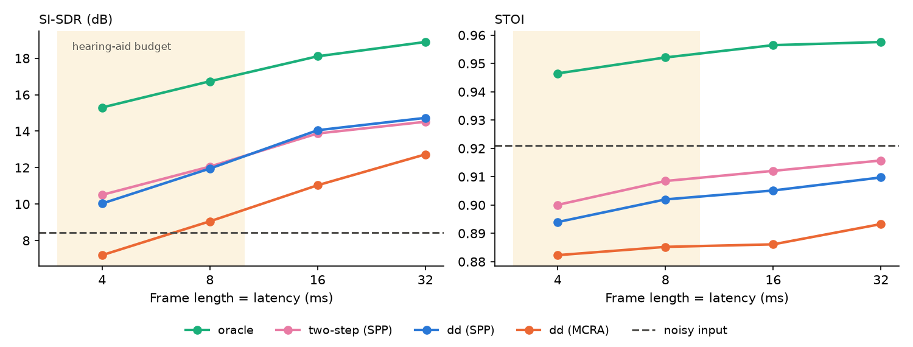
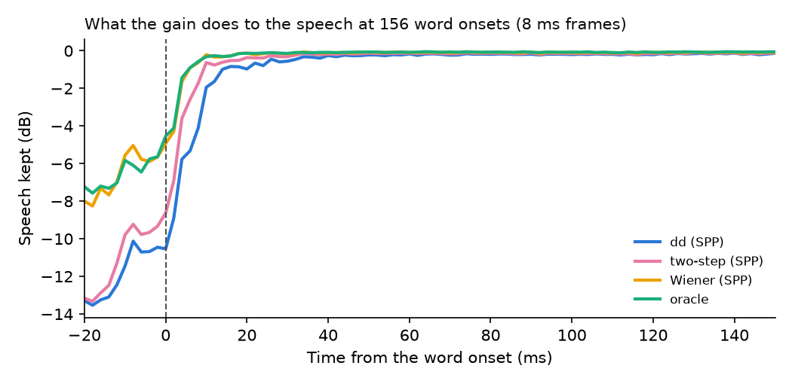
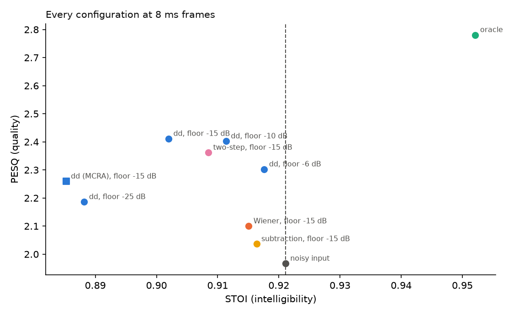
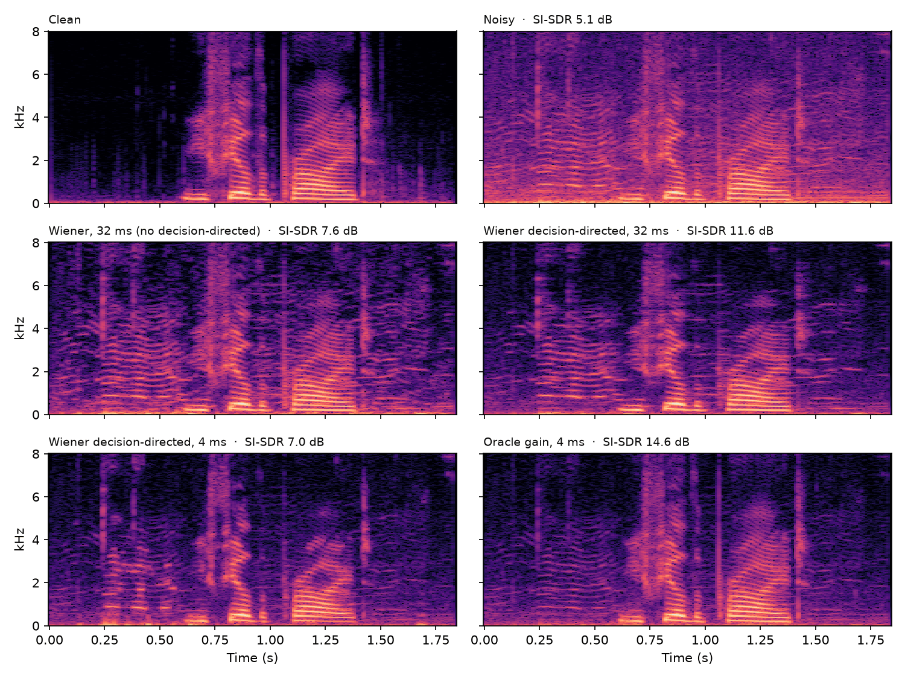
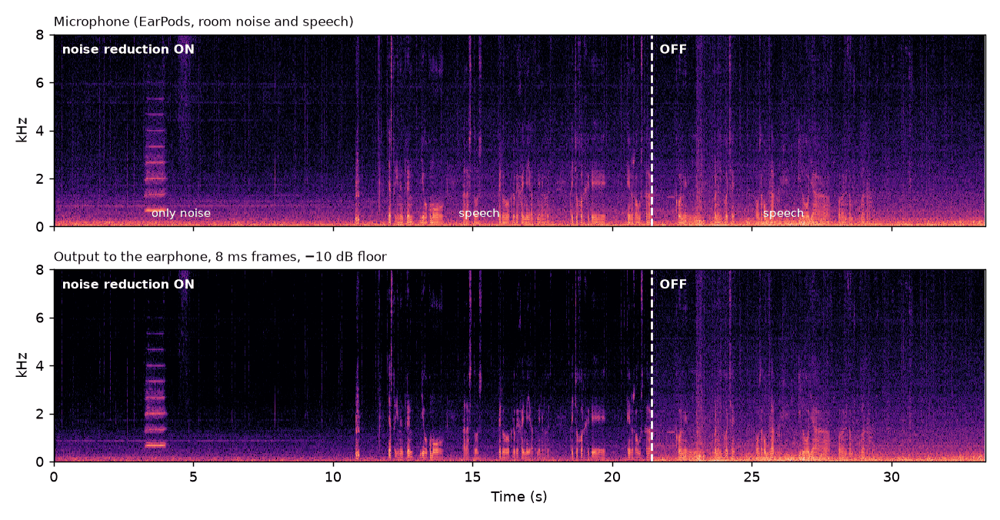

# audiolab

[](https://github.com/victor-merino-hub/audiolab/actions/workflows/tests.yml)

Audio signal processing and machine learning for **hearables**: from DSP fundamentals to
sound classification and noise reduction under real-time constraints.

> Work in progress. I am a Telecommunications Engineering student building this project
> step by step to learn audio DSP and ML in depth. See the [roadmap](#roadmap).

## Results so far

### Environmental sound classification (ESC-50)

[ESC-50](https://github.com/karolpiczak/ESC-50): 2,000 real clips of 5 s in 50 classes, evaluated
with the 5 official cross-validation folds. Chance level is 2%.

| Model | Weights | Accuracy | Reference |
|---|---|---|---|
| MFCC statistics + Random Forest | - | 47.6% ± 2.1% | 44.3% in the ESC-50 paper |
| **CNN on log-mel spectrograms** | 149k | **76.5% ± 2.7%** | 64.5% in Piczak (2015) |
| CNN trained with background noise | 149k | 75.0% ± 4.0% clean, **71.5%** with noise at 20 dB SNR | see [below](#the-digital-silence-shortcut-and-how-noise-training-removes-it) |
| Human listeners | | | 81.3% |


The CNN (4 conv blocks, trained on a laptop CPU in 47 minutes) wins most where the baseline
was blind: averaging MFCCs over time destroys temporal patterns, so **clock tick goes from 5% to 80%**
and car horn from 10% to 82%. Two design experiments, with everything else fixed:

- **Keep the frequency position** (average only over time at the end): +13.6 points. Time shifts
  should not change the class, but frequency position does: a steady tone is a car horn or an
  alarm depending on where it sits. Without it the network cannot even fit its training set.
- **Data augmentation** (time shift + SpecAugment): no measurable gain here (76.5% vs 76.2%). The
  time shift is redundant with a network that already averages over time. For scale: retraining
  the same model on a GPU instead of the CPU changes 9% of the predictions and the mean by 0.5
  points, so differences below ~1 point are noise.

**Sanity checks** before trusting a result this far above the reference: training on shuffled
labels gives 2.2% (chance: 2%), so nothing leaks from the test folds; and the class-dependent
band-limiting the dataset authors warn about is a weak cue (3.9% on its own). The gap with the 2015
CNN is mostly a smaller model (149k vs ~26M weights), whole clips instead of 1 s segments, and batch
normalization.

Notebooks: [exploration](notebooks/02_esc50_exploration.ipynb) · [baseline and leakage](notebooks/03_esc50_baseline.ipynb) · [CNN](notebooks/04_esc50_cnn.ipynb) · [robustness](notebooks/05_esc50_robustness.ipynb) · [real time](notebooks/06_realtime.ipynb)

### The digital silence shortcut, and how noise training removes it

ESC-50 pads short clips to 5 s with exact zeros, more for some classes (glass breaking, sneezing)
than others, and the network learns to use it. A real microphone never outputs exact zeros: adding
pink background noise only 60 dB below the sound leaves the clips without padding untouched
(77.3% → 77.3%) but costs the padded ones 9 points, and 42 points at 20 dB.

Training the same network with background noise (white, pink and brown, at random SNRs between
10 and 60 dB, on 3 of every 4 training examples) removes the shortcut: padded and unpadded clips
now behave the same at every noise level, and glass breaking stays at 95% instead of falling to 38%.
It costs 2 points on the clean benchmark and gains 10 with noise at 20 dB (71.5% vs. 61.3%), which
is the trade a device listening through a real microphone wants.


**Noise augmentation without touching the audio: adding powers.** Instead of adding noise to the
waveform and recomputing the log-mel spectrogram of every training example, the noise is mixed
directly into the spectrogram. For uncorrelated signals

$$|X + N|^2 = |X|^2 + |N|^2 + 2\,\mathrm{Re}(X N^*)$$

and the cross term averages to zero (even more after summing the bins of each mel band), so powers
simply add: `10·log10(10^(S/10) + g·10^(N/10))`, with the gain `g` set by the target SNR. Checked
against mixing the waveforms, the median error is below 0.5 dB with no bias, and the augmentation
costs almost nothing during training. The test noise (pink, added to the waveform) is not exactly
the training noise, but both are synthetic: the real test is a live microphone.

### Real-time demo: what changes with a real microphone

[`scripts/realtime_demo.py`](scripts/realtime_demo.py) classifies the laptop microphone live: every
0.5 s, the latest 2 s go through the training pipeline and the noise-trained CNN, and the top 3
classes are shown. Computation takes ~10 ms per prediction (2% of the hop), so the latency is set by
the design, not by the CPU: a sound appears at most one hop after it starts and leaves the screen 2 s
after it ends. Two things the benchmark never needed: a **level gate**, because the CNN must name one
of its 50 classes even for an empty room (it called silence "snoring"), and a **confidence threshold**.


To evaluate it, I recorded 40 s sessions at home repeating one sound (5 ESC-50 classes, plus speech
and music) and replayed them offline through exactly the same code as the live demo.

**The microphone's own processing was the main problem.** The laptop's default processing (Waves
MaxxAudio) mutes the microphone between sounds: up to 64% of the samples are exact zeros. That
digital silence brought back the shortcut from the previous section: the windows called "glass
breaking" (the most padded ESC-50 class) were 59% zeros, against 24% for the rest. With the processing
off, top-1 accuracy goes from 64% to **72%**, close to the 75% of cross-validation, and the false
glass breaking from 17% to 2% of the windows.


- **Comfort noise does not fix it.** Filling the pauses with pink noise, like a phone does during the
  silences of a call, changes nothing at -80 dBFS and hurts from -70 dBFS on (72% → 55% at -60 dBFS,
  only 2-7 dB above the real room background). The classifier has to listen to the raw microphone
  signal, which is how hearing aids are built: the environment classifier steers the noise reduction
  instead of listening through it.
- **Sounds outside the 50 classes are the open problem.** With a 0.4 confidence threshold, 85% of
  what is shown is correct, but the confidence does not separate known sounds from speech and music
  (AUROC ≈ 0.5): speech is taken for "drinking, sipping" and music for "sheep", as confidently as a
  real knock. That needs a model that knows those sounds (see the [roadmap](#roadmap)).

One person, room and microphone, and 5 classes: the direction of these effects is clear, differences
of a few points are not. Notebook: [real-time evaluation](notebooks/06_realtime.ipynb)

### Noise reduction under a hearing-aid latency budget

A hearing aid has to clean the speech it amplifies within ~10 ms: in an open fitting the direct sound
also reaches the ear, and a processed copy arriving later turns the sum into a comb filter. Textbook
noise reduction uses 32 ms frames. The classical single-microphone pipeline is implemented frame by
frame, exactly as it would run live ([`enhancement`](src/audiolab/enhancement.py)): STFT analysis and
weighted overlap-add synthesis, a noise estimate tracked while the person talks, and a gain per
frequency bin. Its latency is the frame length, so that is the axis of the experiment. Evaluated on the
824 sentences of the VoiceBank+DEMAND test set, the standard benchmark (16 kHz), with three metrics:
SI-SDR (how close the waveform is to the clean speech), STOI (predicted intelligibility) and PESQ
(predicted quality, as listeners would rate it):



- **The price of latency.** The Wiener gain with a decision-directed SNR estimate takes SI-SDR from
  8.4 dB to 14.7 dB with 32 ms frames, but to 12.0 dB with 8 ms and 10.0 dB with 4 ms. An **oracle** gain,
  computed from the true speech and noise, separates the two causes: it also falls (18.9 → 15.3 dB),
  because short frames cannot resolve the harmonics of the voice, and the gap from the oracle to the
  real method, which is the cost of estimating, grows from 4.2 to 5.3 dB. Quality is more forgiving:
  PESQ goes from 1.97 for the input (the published value for this test set) to 2.45 at 32 ms and 2.41
  at 8 ms, which keeps 92% of the gain; 4 ms keeps only half (2.20).
- **The noise estimator matters as much as the gain rule.** The classic minimum-tracking estimator
  (MCRA) takes in the start of every word before its speech detector reacts, and overestimates the noise
  by 1-3 dB, so the gain cuts speech; at 4 ms its output is worse than the noisy input. Replacing it with
  a speech-presence-probability estimator gains 2-3 dB at every frame length.
- **Cleaner, but not more intelligible.** No real method raises STOI above the noisy input (0.921), and
  the one that removes the most noise lowers it most, especially at low SNR, where help is needed most.
  The oracle reaches 0.946-0.958, so a gain per bin *can* help intelligibility; the classical estimate of
  it cannot. For a device whose purpose is understanding speech, this is the case for a learned
  estimator.
- **Part of that loss is at the start of every word.** Applying the gains to the clean speech alone
  shows what they remove: the decision-directed rule leans on the previous, noise-only frame, so at a
  word onset its gain rises late and removes 4.9 dB of the first 10 ms (the oracle: 0.9 dB), right on
  the short consonants. Its two-step refinement (Plapous et al., 2006) halves that and raises STOI by
  +0.006 at every frame length, in 92-96% of the sentences. That is a third of the loss at 8 ms. The
  rest is not timing (plain Wiener treats onsets almost like the oracle and still loses STOI); most
  likely it is the SNR misestimated where the speech is below the noise.



- **Quality and intelligibility pull in opposite directions.** The decision-directed rule, which
  suppresses the "musical noise" of simpler rules, has the best PESQ and the worst STOI. The gain floor,
  the maximum attenuation, sets the balance: at 8 ms, a −10 dB floor keeps the quality of −15 dB (PESQ
  2.40 vs. 2.41) with clearly more intelligibility (STOI 0.911 vs. 0.902), while −25 dB is worse in all
  three metrics. That is the best compromise among the configurations tested, and why hearing aids
  limit the attenuation instead of removing all the noise.





PESQ is computed in Colab ([`denoising_pesq.ipynb`](notebooks/denoising_pesq.ipynb)), since the
package needs a C compiler. Notebook: [noise reduction](notebooks/07_noise_reduction.ipynb)

### A live hearing aid on a laptop, and why it cannot be one

[`scripts/hearing_aid_demo.py`](scripts/hearing_aid_demo.py) runs the same noise reduction live:
microphone → 8 ms frames → wired earphones. To measure the delay of the audio chain itself, it plays
a chirp through the earphone and records it with the microphone, like a radar: a matched filter
finds the echo, averaged over 11 periods so that it stands out from the room noise. Round trip of the
sound card, drivers and operating system:

| Windows audio API | Round trip | + algorithm (8 ms frames) |
|---|---|---|
| MME (the default) | 78.7 ms | 86.7 ms |
| WASAPI, exclusive mode | 81.5 ms | 89.5 ms |
| WDM-KS | 47.0 ms | 55.0 ms |

The algorithm fits a hearing-aid budget; the laptop adds 6 to 10 times as much. With open earbuds the
direct sound arrives first and the processed one 55 ms later, which sounds like an echo and hides the
noise reduction: the noise that leaks in directly cannot be removed. That is the platform, not the
code. A recorded session (the microphone input, the output and a log of every block) replayed offline
through the same chain gives the same output to 16-bit precision, with no lost blocks (0 of 8,353;
0.27 ms of computation per 4 ms block), and it removes 9 dB of room noise in the pauses and ~3 dB on
the speech peaks:



A short tonal sound at 3.5 s passes untouched: for the estimator, noise is what stays steady. Telling
what a sound is belongs to the classifier above, which is why a hearing aid uses both.

### Data leakage: how a random split lies

40% of the ESC-50 clips were cut from the same original recording as another clip, and share its
microphone, room and background noise. The official folds keep them together. Splitting at random
instead reports **58.2% instead of 47.6%**: 10.6 points that are not real. The gain appears only
in the clips whose "sibling" ended up in training (49% → 74%), while the rest barely change
(47% → 50%): the model is recognizing recordings, not sounds. Removing the microphone's
fingerprint with cepstral mean normalization halves the leakage (+4.7 points) but costs 16 points
of accuracy, since it also removes the timbre of continuous sounds.


For a hearable this matters: it has to work in every user's home, not on the recordings it was
trained on.

## What's inside

| Module | What it does |
|---|---|
| `generator` | Periodic signals (sine, square, triangle, sawtooth) with aliasing checks |
| `analysis` | FFT spectrum and spectrogram |
| `processing` | Speed change vs. time-stretch (phase vocoder), pink background noise at a given SNR |
| `audio_io` | Load, save and record audio |
| `dataset` | Labeled synthetic datasets with a controlled SNR |
| `features` | MFCC, log-mel spectrograms and harmonic-structure features |
| `model`, `deep` | CNN on spectrograms (PyTorch) |
| `esc50` | ESC-50 metadata and clip loading |
| `evaluation` | Cross-validation on predefined folds, random folds for comparison |
| `realtime` | Ring buffer, level gate and live classification of microphone audio, with offline replay of recorded sessions |
| `enhancement` | Streaming STFT/WOLA, noise estimation (MCRA, speech presence probability), spectral subtraction, Wiener, decision-directed and two-step gains, oracle gain, SI-SDR |

Scripts live in [`scripts/`](scripts/): `train_cnn_esc50.py` trains a CNN configuration with 5-fold
cross-validation and saves its predictions for the analysis notebook; `realtime_demo.py` runs the live
demo and can record sessions, which `evaluate_home.py` replays offline with any settings;
`evaluate_denoising.py` runs every noise reduction method on the VoiceBank+DEMAND test set; and
`hearing_aid_demo.py` is a minimal live hearing aid (microphone → noise reduction → wired headphones)
that also measures the latency of the audio chain.

The notebook [`01_fundamentals.ipynb`](notebooks/01_fundamentals.ipynb) walks through all of
them. One result from it: a RandomForest classifying waveforms reaches ~0.89 accuracy with
generic MFCC features, but **1.00 with 8 hand-crafted features** based on the Fourier series of
each waveform (square: odd harmonics at 1/k, triangle: 1/k², sawtooth: all at 1/k). Domain
knowledge beats generic features when the problem is well understood.

The tests check physical properties rather than just "it runs": the spectrum of a sine peaks
at ±f with amplitude A/2, the harmonic ratios match the Fourier series, the measured SNR
matches the requested one, and time-stretching keeps the pitch.

## Roadmap

- [x] **DSP fundamentals**: signal generation, spectrum, spectrogram, time-stretch
- [x] **Project setup**: installable package, tests, CI
- [x] **ESC-50 baseline**: MFCC + Random Forest over the 5 official folds
- [x] **Data leakage experiment**: random split vs. official folds
- [x] **CNN on log-mel spectrograms** (ESC-50), with error analysis
- [ ] **Pretrained audio model** (AudioSet embeddings): the accuracy ceiling, how much a
      hearable-sized model gives up (accuracy vs. model size), and sounds outside ESC-50 (speech, music)
- [x] **Digital silence shortcut**: measure the accuracy drop when the padding is replaced by
      background noise
- [x] **Noise augmentation**: train with background noise so the shortcut disappears
- [x] **Real-time demo**: classify live microphone input, and measure it on sounds recorded at home
- [x] **Noise reduction**: spectral subtraction and Wiener filtering frame by frame, with the quality
      vs. latency trade-off measured on VoiceBank+DEMAND (SI-SDR, STOI, PESQ)
- [x] **Live hearing-aid demo**: latency of the audio chain measured, real-time output verified against
      offline processing
- [ ] **Noise reduction, next**: estimate the gain with a long frame and apply it with a short filter
      (the low-delay trick of hearing aids), a small network that estimates the gain, and a low-latency
      audio platform for the live demo
- [ ] **Hearable constraints**: latency budget, model size, quantization / ONNX export

## Project structure

```
src/audiolab/   the package
notebooks/      experiments and explanations
scripts/        training, live demo and evaluation scripts
models/         the trained model used by the live demo
docs/figures/   figures used in this README
tests/          pytest test suite
data/           audio files (not committed)
```

## Getting started

Requires Python 3.10+.

```bash
git clone https://github.com/victor-merino-hub/audiolab.git
cd audiolab
python -m venv .venv
source .venv/bin/activate        # Windows: .venv\Scripts\activate
pip install -e ".[dev]"
pytest
```

The ESC-50 notebooks expect the dataset (~600 MB) unzipped in `data/ESC-50/`: download it from
[github.com/karolpiczak/ESC-50](https://github.com/karolpiczak/ESC-50). It is licensed
CC BY-NC 3.0 by Karol J. Piczak and is not redistributed here. The included model was trained on it,
so to respect that license its weights are for non-commercial use only.

The noise reduction notebook expects the VoiceBank+DEMAND test set (~310 MB, CC BY 4.0) in
`data/voicebank/`: `clean_testset_wav.zip` and `noisy_testset_wav.zip` from the
[Edinburgh DataShare](https://datashare.ed.ac.uk/handle/10283/2791), unzipped there.

The trained model used by the live demo is included ([`models/esc50_cnn_noise.pt`](models/), 600 KB:
weights, input normalization and class names), so the demo only needs a microphone. Stay quiet for the
first 2 s, while it measures the background:

```bash
python scripts/realtime_demo.py
```

Training a CNN takes ~47 minutes on a laptop CPU. To use a free GPU instead, open
[`gpu_training.ipynb`](notebooks/gpu_training.ipynb) in Google Colab or Kaggle: it clones this
repository, downloads ESC-50, trains, and packages the models for download.

```python
from audiolab.generator import generate_signal
from audiolab.analysis import compute_spectrum

t, y = generate_signal("square", frequency=440, amplitude=0.5, fs=44100, duration=1.0)
f, P = compute_spectrum(y, fs=44100)
```

## License

[MIT](LICENSE)
